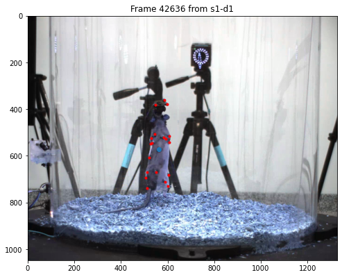

#  RAT7M Dataset 

RAT7M is an animal (rats) pose estimation database containing near 7 million frames with corresponding 2D & 3D poses from motion capture. 


The scripts in this repository enable automatically downloading, frame extracting and annotation processing of the original RAT7M release. Given the massive number of available frames in RAT7M, we offer additional instructions for generating 2D training and test frames, used in [Geometric deep learning enables 3D kinematic profiling across species and environments (Dunn et al. 2021, Nat Methods)](https://www.nature.com/articles/s41592-021-01106-6). 

## Prerequisites


## Download
To download the dataset, simply run `python download_all.py`, which yields:
* `video_sequences` containing all *.mp4 video sequences (n=2028).
    * Each video is named with the fashion of `{subject_id}-{recording-day}-{camera_id}-{starting_frame_idx}.mp4` and should contain at most 3500 frames.
* `annnotations` with motion capture data and camera parameters.
* (`zips` containing all original data in zip format)

## Extracting training & test frames from videos
* **Notice**: Subject5-Day2 was excluded from this specific subset of training and test frames.

### Download additional annotation file
Download [rat7m_train_test_annotation.pkl](https://drive.google.com/file/d/1oNctPQ8wDI-gjo7tvEI7Sip1HTBkd18a/view?usp=sharing).

This annotation file is organized as a nested dictionary:
```
{'cameras': Dict[subject_idx][day_idx],
 'camera_names': List of str,

 'table': {
    'subject_idx': array of int - subject ID,
    'day_idx': array of int - recording day, 
    'cluster_idx': array of int, 

    'image_paths': Dict[camera_name] - relative path to right image,
    'frame_idx': Dict[camera_name] - video frame index,
    '2D_keypoints: Dict[camera_name] - 2D keypoints w.r.t each camera view,
    '3D_keypoints': array - 3D keypoints,
    '2D_com': Dict[camera_names] - center of mass computed from averaging all 2D keypoints}
}
```
It should contain most information needed for pose estimation training.

### Frame extraction
Run `python extract_frames.py`, which should yield
* `images_unpacked` containing all unpacked frames.

### Sanity check by visualization
Open `visualization.ipynb` and follow the instructions inside. You should be seeing an image similar to 



## Now you may start your own project with RAT7M!
If you use this dataset, please kindly cite:

Marshall, Jesse D.; Aldarondo, Diego; Wang, William; P. Ölveczky, Bence; Dunn, Timothy (2021): Rat 7M Videos Subject 1 - Day 1. figshare. Dataset. https://doi.org/10.6084/m9.figshare.13751023.v1 