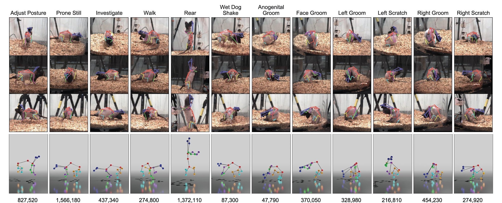

#  RAT7M: 3D Rodent Behaviorial Tracking Benchmark


# Description
**RAT7M** is an animal (rat) pose estimation database containing nearly 7 million frames with 2D & 3D keypoints acquired from motion capture across a diverse variety of rodent poses. This dataset was initially used in our paper [Geometric deep learning enables 3D kinematic profiling across species and environments (Dunn et al. 2021, Nat Methods)](https://www.nature.com/articles/s41592-021-01106-6), i.e. [DANNCE (code release)](https://github.com/spoonsso/dannce). 

Given the massive number of available frames in the dataset, additional instructions are offered in this repository for generating a smaller subset of 2D frames from the full RAT7M release， referred as **"mini-RAT7M"**. We anticipate that it can be used as a reliable benchmark in the development of animal/rodent tracking algorithms, especially under common deep learning frameworks such as PyTorch and Tensorflow.

**Table of Contents**
- [Downloads](#downloads)
    - [Prerequisites](#prerequisites)
    - [Dataset download and overview](#dataset-download-and-overview)
- [Generate mini-RAT7M](#generate-mini-rat7m)
    - [Overview](#overview)
    - [Download annotation](#download-annotation)
    - [Frame Extraction](#frame-extraction)
    - [Visualization](#sanity-check-by-visualization)
- [Compute error metrics](#compute-error-metrics)
    - [Introduction to common metrics](#common-metrics)
    - [Utility functions](#utility-functions)
- [Reference](#now-you-may-start-your-own-project-with-rat7m)

# Downloads
## Prerequisites
It is expected to run the following in a **Python3** environment, with extra dependencies on:
* opencv-python
* urllib3
* (optional, only for visualization) matplotlib

Make sure there is at least 300 GB free disk space.

## Dataset download and overview
To download the dataset, run `python download_all.py`, which will yield 3 new folders under the current directory:
* `video_sequences` containing *.mp4 videos (n=2028).
    * These videos were recorded on **5 subjects**, denoted as `"s1", "s2", "s3", "s4", "s5"`. 
    * Depending on when the recording took place, there exists **7 different recordings**, denoted as `"s1-d1", "s2-d1", "s2-d2", "s3-d1", "s4-d1", "s5-d1" and "s5-d2"`.
    * In the actual RAT7M, each recording was broken down into a series of video sequences containing at most 3500 frames for better reference. 
    * Each video sequence is named with the fashion of `{subject_id}-{recording-day}-{camera_id}-{starting_frame_idx}.mp4`.
* `annnotations` containing *.mat files with motion capture data and camera parameters (n=7).
    * Each .mat file corresponds to a specific recording (e.g. "s1-d1") and is named as `mocap-{subject-id}-{recording-day}.mat`.
    * Inside, each annotation file contains
        * `cameras`: extrinsic and intrinsic parameters for each camera.
            * `'IntrinsicMatrix'`: 3x3 matrix **K** about camera internal properties, including focal lengths, principal points and skewness. 
            * `'RotationMatrix'`: 3x3 matrix **R**.
            * `'TranslationVector'`: 1x3 vector **t**. 
                * **R** and **t** are usually referred together as "camera extrinsics", describing the position and orientation of a camera in the world coordinate system.
            * `'TangentialDistortion'`: 1x2 vector describing the distortion from the lens and the image plane not being parallel. 
            * `'RadialDistortion'`: 1x2 vector describing the distortion where light rays bend more away from the optical center. 
        * `mocap`: **3D** coordinates for **20 body joints** from motion capture. 
        * `name`: name of the recording ("Subject1-Day1").
    * We recommend using the utility functions `load_cameras()` and `load_mocap()` in `matlab_utils.py` to load the annotations.
* (`zips` containing all original data in zip format; can be deleted.)

If needed, the dataset can also be downloaded manually from [Figshare](https://figshare.com/collections/Rat_7M/5295370).

# Generate mini-RAT7M
## Overview
mini-RAT7M contains N=112730 data samples/timesteps extracted from the existing video sequences. 

Notice that each data sample DOES NOT correspond to one single image, but from 6 synchronized camera views. 
* Train: n = 88194
    * s1-d1: 17812
    * s2-d1: 17441
    * s2-d2: 19728
    * s3-d1: 19845
    * s4-d1: 13368
* Test: n = 24536
    * s5-d1: 10445
    * s5-d2: 14091


## Download annotation
Use the Google Drive link to download [mini_rat7m_train_test_annotation.pkl](https://drive.google.com/file/d/1sZwwX2v0NGkT9j3I5-QCetCxCKEZk5U-/view?usp=sharing). Besides the corresponding annotations from the full RAT7M, it also contains information needed for extracting the right frames from video sequences. 

### Organization: 
```javascript
annot_dict = {
    "cameras": dict[subject_idx][day_idx][camera_name] // dict of camera parameters as introduced above
    "camera_names": numpy.ndarray // "Camera1"

    "table": {
        "subject_idx": numpy.ndarray //subject ID (1, 2, 3, 4, 5)
        "day_idx": numpy.ndarray //recording day (1, 2)
        "train_test": numpy.darray //"train" or "test"
        "frame_idx": dict[camera_name] //video frame index
        "image_path": dict[camera_name] //relative path to image "images_unpacked/s1-d1/camera1/frame_000014.jpg"
        "2D_keypoints": dict[camera_name]  //2D keypoints w.r.t each camera, with shape [20, 2]
        "2D_com": dict[camera_names]  //2D center of mass
        "3D_keypoints": numpy.ndarray //3D keypoints with shape [20, 3]   
}
```
* `"table"` is another nested dictionary where each entry's last level is designated to be a **numpy.array of size N=112730**, the total number of data samples. This organization makes data fetching easier under common deep learning frameworks.

### Several examples about how to use this annotation file:
* Camera parameters for the "s4-d1" recording: `annot_dict['cameras'][4][1]`
* Name of the 4th camera: `annot_dict['camera_names'][3]`
* Find data samples corresponding to s5-d1: `np.logical_and(annot_dict['table']['subject_idx'] == 5, annot_dict['table']['day_idx'] == 1)`
* 2D keypoint coordinates for the i-th data point from camera 4: `annot_dict['table']['2D_keypoints']['Camera4'][i-1]`

## Frame extraction
Run `python extract_frames.py`, which should yield
* `images_unpacked` containing all unpacked 2D frames. 

    It is organized as follows:
    ```
    - images_unpacked/
        - s1-d1/
            - camera1/
                - frame_00014.jpg
                - ....
            - camera2/
            - camera3/
            - camera4/
            - camera5/
            - camera6/
        - s2-d1/
        - s2-d2/
        - s3-d1/
        - s4-d1/
        - s5-d1/
    ```
## Sanity check by visualization
Open `visualization.ipynb` and follow the instructions inside. If everything works correctly, you should be seeing a random image similar to 


where
* 20 body keypoints are marked in red
* 2D center of mass is marked in blue
* 21 pairs of keypoints are connected correspondingly based on rat anatomy.

# Compute error metrics
## Common metrics
* **Mean Per-Joint Position Error (MPJPE)**: mean Euclidean/L2 distances between predicted keypoints and ground truth.
* **Procrustes Analysis MPJPE (PA-MPJPE)**: MPJPE after rigid alignment with the ground truth skeletons after translation, rotation and scale).
* **Normalized MPJPE (N-MPJPE)**: MPJPE after scale normalization to make the evaluation independent of subject size.

## Utility functions
* We include helper functions that help compute the above metrics in the script `metrics.py` contains helper functions. To use, simply add `from metrics import mpjpe, pa_mpjpe, n_mpjpe` to your evaluation script.
* Each function expects two arguments:
    * `predicted`: numpy.darray of shape (n_samples, n_joints, 2/3)
    * `target`: numpy.darray of shape (n_samples, n_joints, 2/3)

    and returns the error metric results for each sample：
    * numpy.darray of shape (n_sample, 1)

# Now you may start your own project with RAT7M!
If you use this dataset, please kindly cite:
```
@article{dunn2021geometric,
  title={Geometric deep learning enables 3D kinematic profiling across species and environments},
  author={Dunn, Timothy W and Marshall, Jesse D and Severson, Kyle S and Aldarondo, Diego E and Hildebrand, David GC and Chettih, Selmaan N and Wang, William L and Gellis, Amanda J and Carlson, David E and Aronov, Dmitriy and others},
  journal={Nature methods},
  volume={18},
  number={5},
  pages={564--573},
  year={2021},
  publisher={Nature Publishing Group}
}
```